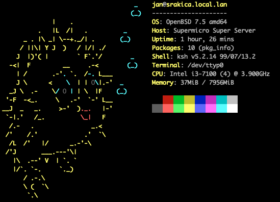

I run pfSense on my router but the company behind it has started being very anti-community and almost stopped supporting their CE  version. So I faced a dilemma. Migrate to OpnSense, VyOS, or something  else? I heard many good things about OpenBSD so I thought to myself  "Why not"? I especially like OpenBSD's commitment to high security standards and that's exactly what's needed for a router and a firewall that protects your home network.



_This is my first configuration for an OpenBSD-based router. Mistakes are expected. You're welcome to open issues or PRs to help add features or additional configurations. This guide will be quarterly updated or when I add something useful to it._

## Hardware used

[OpenBSD](https://www.openbsd.org/) supports a lot of old hardware so pick something. I chose a Supermicro server with the following specifications:

- Motherboard: [Supermicro X11SSH-LN4F](https://www.supermicro.com/en/products/motherboard/x11ssh-ln4f)
- Processor: Intel i3-7100 @ 3.90 Ghz
- RAM: DDR4 8 GB ECC
- SSD: 128 GB NvME

## My network 

### I segregate my network with the following VLANs

- LAN - only network hardware devices
- VLAN 10 - admin management devices
- VLAN 20 - servers
- VLAN 30 - desktop PCs
- VLAN 40 - trusted Wi-Fi devices
- VLAN 41 - guest Wi-Fi devices
- VLAN 42 - IoT wired and Wi-Fi devices
- VLAN 50 - NVR and cameras
- VLAN 60 - testing VLAN
- VLAN 70 - Mullvad VPN

### Subnets for DHCP server:

- LAN subnet is 10.0.0.0/24
- VLAN 10 subnet is 10.10.0.0/24, range 10.10.0.20 - 10.10.0.254
- VLAN 20 subnet is 10.20.0.0/24, range 10.20.0.20 - 10.20.0.254
- VLAN 30 subnet is 10.30.0.0/24, range 10.30.0.20 - 10.30.0.254
- VLAN 40 subnet is 10.40.0.0/24, range 10.40.0.20 - 10.40.0.254
- VLAN 41 subnet is 10.40.1.0/24, range 10.40.1.20 - 10.40.1.254
- VLAN 42 subnet is 10.40.2.0/24, range 10.40.2.20 - 10.40.2.254
- VLAN 50 subnet is 10.50.0.0/24, range 10.50.0.20 - 10.50.0.254
- VLAN 60 subnet is 10.60.0.0/24, range 10.60.0.20 - 10.60.0.254
- VLAN 70 subnet is 10.70.0.0/24, range 10.70.0.20 - 10.70.0.254

### Firewall rules:

- WAN has no access from outside (you can't ping or SSH into a router)
- LAN can access all VLANs and the internet
- VLAN 10 can access all VLANs, LAN, and internet
- VLAN 20 subnet is 10.20.0.0/24 and can access VLAN 42, VLAN 50, and the internet
- VLAN 30 can access all VLANs, LAN, and internet
- VLAN 40 can access all VLANs, LAN, and internet
- VLAN 41 can't access any VLANs only the internet
- VLAN 42 can't access any VLANs only the internet
- VLAN 50 can't access any VLANs or the internet
- VLAN 60 can't access any VLANs or the internet
- VLAN 70 can't access any VLANs only the internet
- Open port 32400 to be reached from the internet to local IP 10.20.0.11

## Guide

### 1. [Install OpenBSD](https://www.openbsdhandbook.com/installation/) to your hardware of choice. I suggest skipping installing the following sets (not needed for router and firewall): 

```
[X] bsd           [ ] comp7X.tgz    [ ] xbase7X.tgz   [ ] xserv7X.tgz
[X] bsd.rd        [X] man7X.tgz     [ ] xshare7X.tgz
[X] base7X.tgz    [ ] game7X.tgz    [ ] xfont7X.tgz
```

### 2.  Configure network interfaces

Check which network interfaces you have with `ifconfig`. I have `em0`, `em1`, `em2`, and `em3` but I'll be using only `em0` for WAN and `em1` for LAN. I'll be writing from the perspective of my configuration.

#### Configure your WAN interface

If you have a dynamic IP from your ISP:

Edit /etc/hostname.em0

```
dhcp
```

If you have a static IP from your ISP (IP and Gateway is provided by your ISP):

```
inet 34.xx.xx.xx 38.xx.xx.xx
up
```

#### Create VLAN interfaces

Edit /etc/hostname.vlan10:

```
inet 10.10.0.1 255.255.255.0
vlan 10 vlandev em1
```

Repeat this process for VLANs 20, 30, 40, 41, 42, 50, 60, and 70, adjusting the IP address accordingly.

### 3. Enable packet forwarding

Edit /etc/sysctl.conf:

```
net.inet.ip.forwarding=1
```

### 4. Configure your DHCP server

Edit /etc/dhcpd.conf:

```
# dhcpd.conf for OpenBSD router

# Global parameters
option domain-name-servers 1.1.1.1, 1.0.0.1;
default-lease-time 600;
max-lease-time 7200;

# LAN subnet
subnet 10.0.0.0 netmask 255.255.255.0 {
    range 10.0.0.20 10.0.0.254;
    option routers 10.0.0.1;
    option subnet-mask 255.255.255.0;
    option broadcast-address 10.0.0.255;
}

# VLAN 10
subnet 10.10.0.0 netmask 255.255.255.0 {
    range 10.10.0.20 10.10.0.254;
    option routers 10.10.0.1;
    option subnet-mask 255.255.255.0;
    option broadcast-address 10.10.0.255;
}

# VLAN 20
subnet 10.20.0.0 netmask 255.255.255.0 {
    range 10.20.0.20 10.20.0.254;
    option routers 10.20.0.1;
    option subnet-mask 255.255.255.0;
    option broadcast-address 10.20.0.255;
}

# VLAN 30
subnet 10.30.0.0 netmask 255.255.255.0 {
    range 10.30.0.20 10.30.0.254;
    option routers 10.30.0.1;
    option subnet-mask 255.255.255.0;
    option broadcast-address 10.30.0.255;
}

# VLAN 40
subnet 10.40.0.0 netmask 255.255.255.0 {
    range 10.40.0.20 10.40.0.254;
    option routers 10.40.0.1;
    option subnet-mask 255.255.255.0;
    option broadcast-address 10.40.0.255;
}

# VLAN 41
subnet 10.40.1.0 netmask 255.255.255.0 {
    range 10.40.1.20 10.40.1.254;
    option routers 10.40.1.1;
    option subnet-mask 255.255.255.0;
    option broadcast-address 10.40.1.255;
}

# VLAN 42
subnet 10.40.2.0 netmask 255.255.255.0 {
    range 10.40.2.20 10.40.2.254;
    option routers 10.40.2.1;
    option subnet-mask 255.255.255.0;
    option broadcast-address 10.40.2.255;
}

# VLAN 50
subnet 10.50.0.0 netmask 255.255.255.0 {
    range 10.50.0.20 10.50.0.254;
    option routers 10.50.0.1;
    option subnet-mask 255.255.255.0;
    option broadcast-address 10.50.0.255;
}

# VLAN 60
subnet 10.60.0.0 netmask 255.255.255.0 {
    range 10.60.0.20 10.60.0.254;
    option routers 10.60.0.1;
    option subnet-mask 255.255.255.0;
    option broadcast-address 10.60.0.255;
}

# VLAN 70
subnet 10.70.0.0 netmask 255.255.255.0 {
    range 10.70.0.20 10.70.0.254;
    option routers 10.70.0.1;
    option subnet-mask 255.255.255.0;
    option broadcast-address 10.70.0.255;
}

# Static IP assignment example (uncomment and modify as needed)
# host static-host {
#     hardware ethernet 00:11:22:33:44:55;
#     fixed-address 10.20.0.11;
# }
```

### 5. Configure PF firewall

Edit /etc/pf.conf:

```
# Macros
ext_if = "em0"
int_if = "em1"

# Tables
table <lan> { 10.0.0.0/24 }
table <vlan10> { 10.10.0.0/24 }
table <vlan20> { 10.20.0.0/24 }
table <vlan30> { 10.30.0.0/24 }
table <vlan40> { 10.40.0.0/24 }
table <vlan41> { 10.40.1.0/24 }
table <vlan42> { 10.40.2.0/24 }
table <vlan50> { 10.50.0.0/24 }
table <vlan60> { 10.60.0.0/24 }
table <vlan70> { 10.70.0.0/24 }

# Options
set skip on lo
set block-policy return
set loginterface $ext_if

# Normalization
match in all scrub (no-df random-id max-mss 1440)
match out on $ext_if scrub (no-df random-id)

# Anti-spoofing
antispoof quick for { $ext_if $int_if }

# NAT
match out on $ext_if from !($ext_if) to any nat-to ($ext_if:0)

# Port forwarding
pass in on $ext_if proto tcp from any to ($ext_if) port 32400 rdr-to 10.20.0.11

# Default block
block all

# Allow established connections
pass in quick on $int_if from { <lan> <vlan10> <vlan20> <vlan30> <vlan40> <vlan41> <vlan42> <vlan70> } to any keep state

# WAN rules
pass out on $ext_if proto { tcp udp icmp } all modulate state
# pass in on $ext_if proto tcp to ($ext_if) port ssh # Needed only when set up within the existing network
pass in on $ext_if inet proto icmp icmp-type echoreq

# LAN and VLAN outbound rules
pass from { <lan> <vlan10> <vlan20> <vlan30> <vlan40> } to any keep state
pass from { <vlan41> <vlan42> <vlan70> } to $ext_if keep state

# ICMP rules
pass inet proto icmp all icmp-type echoreq

# Logging (optional, remove if not needed)
pass log (all) quick on $ext_if
```

### 6. Enable and start services

```
# rcctl enable dhcpd
# rcctl enable pf
# rcctl start dhcpd
# rcctl start pf
```

### 7. Apply network configuration

```
# sh /etc/netstart
```

## Future

In the future, I'll add a VPN guide on how to connect to [Mullvad VPN](https://mullvad.net/en) and route it through an entire VLAN. I'll also add a guide on how to configure Wireguard to safely connect back home when needed.

_[Original repo will be updated on my Github](https://github.com/th0r88/openbsd-router/)._

## Sources

- [OpenBSD MAN pages](https://man.openbsd.org/)
- [OpenBSD router](https://openbsdrouterguide.net/)
- [OpenBSD - veb's, vport's and vlan's](https://kaizo.org/2022/10/28/openbsd-wifi-vlans/)